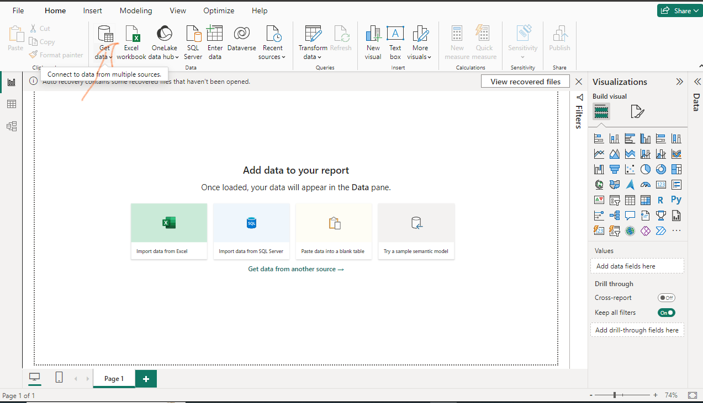
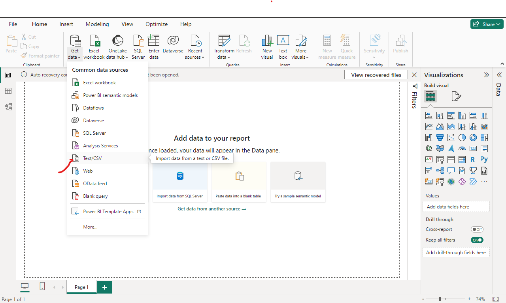
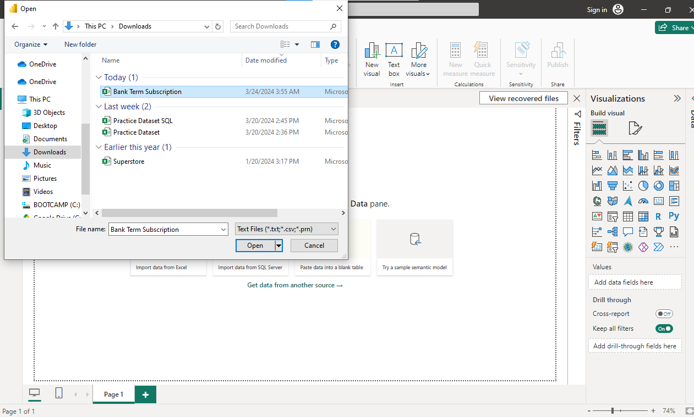
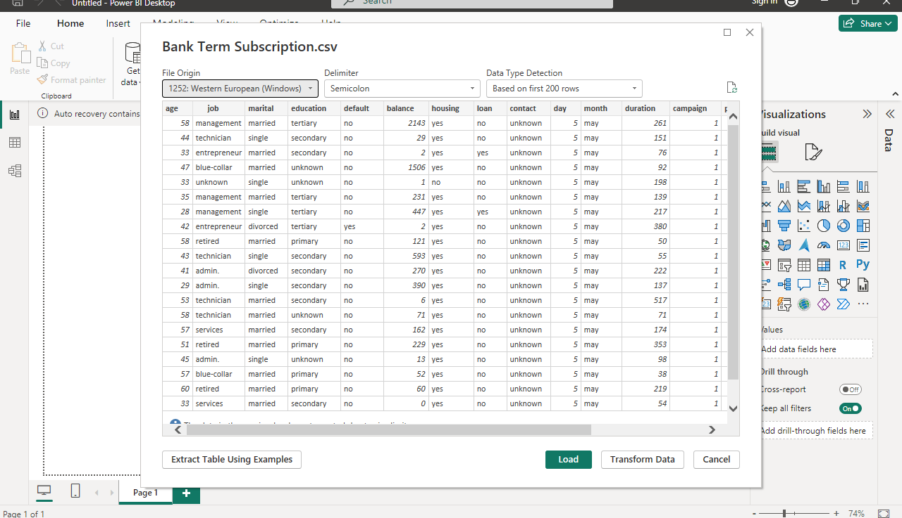
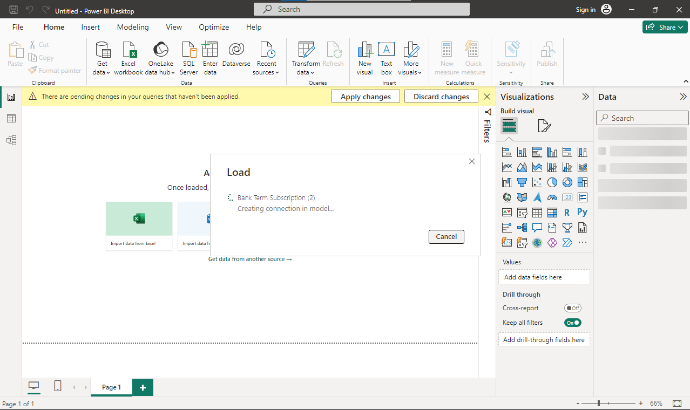
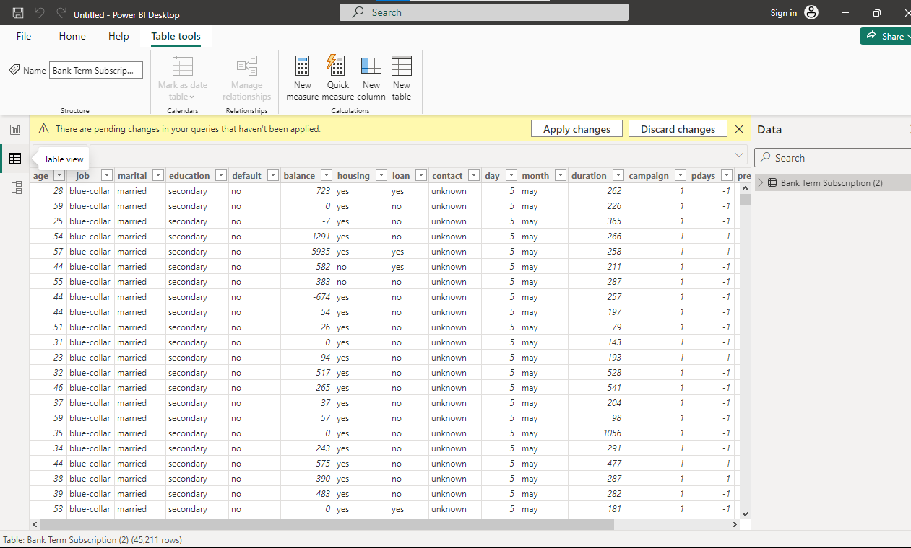
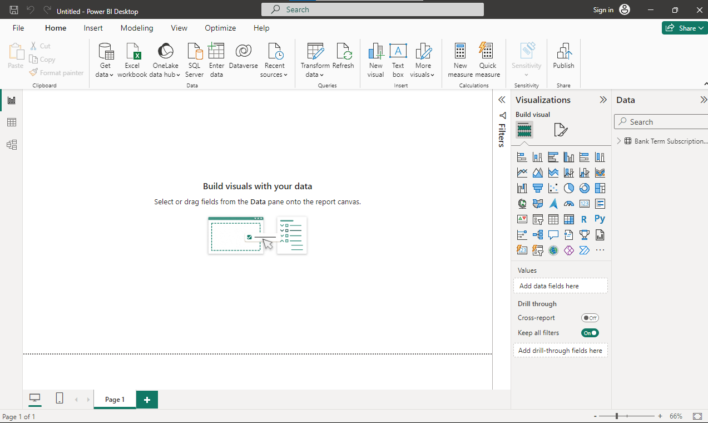
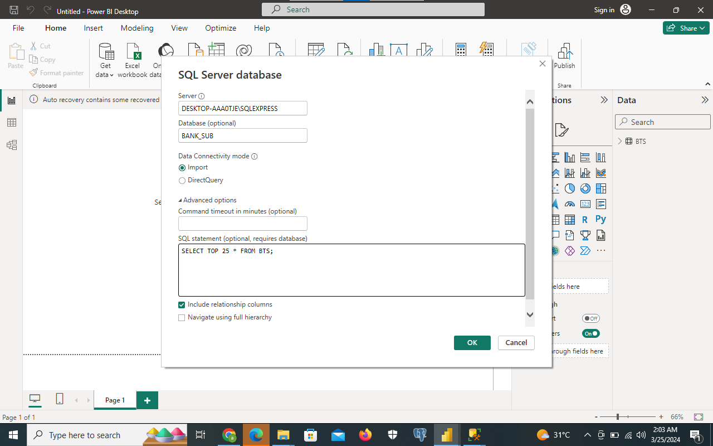

# Importing_Bank_Term_Deposit_Subscription_Dataset_into_Power_BI_Desktop_a_csv_file
# Problem Statement
Import the Bank Term Subscription  dataset into your POwerBI Desktop using the CSV fike option Load the dataset into a database in SQL Server, connect your PowerBI desktop to the database and import only the first 25 rows into your desktop for analysis.

Step One; In your PowerBI Desktop, In your Home tab ribbon, Click on Get data

Step Two; Click On Text/CSV

Step Three; Locate your desired CSV File and click Open

Step Four; Preveiw the data and click load

Step Five; Load the data into your PowerBI Desktop

Step Six; Here's your data

## To Load the dataset into a database in SQL Server, connect your PowerBI desktop to the database and import only the first 25 rows into your desktop for analysis.
Step One; Click on SQL Server in the Home Tab ribbon

Step Two; Input the sesrver name, the databse, clcick import and clck on Advance settings to write oput the SQL code

Step Three; Before typing out your SQL codes, check it in the SQL Server Database
1) OPen SQL Server
2) Use Database the already contains the data we need
3) Select all data in the tabel to check data
4) Select the top 25 rows
   
Step Four; Input the codes in your Powewr BI Desktop

Here you have your data

 
